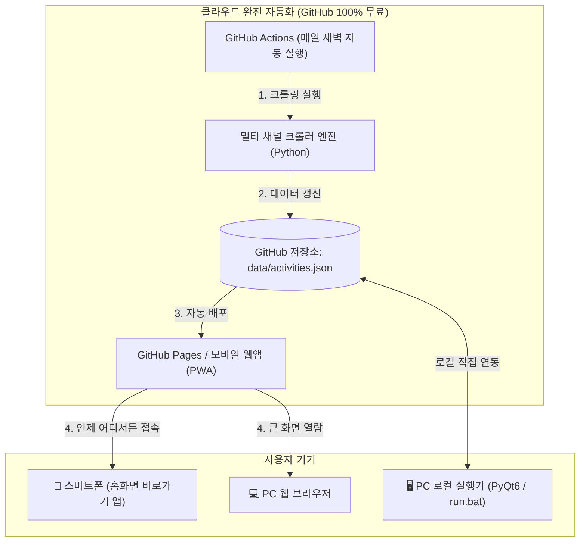

# 🎈 Kids_Activity_Finder (어린이 체험·행사·대회 통합 탐색기)

> **"주말에 아이와 어디 가지? 어떤 대회/체험이 있지?"**  
> **성남시 및 인접 수도권(과천/서울 등)** 중심의 공공도서관·박물관·과학관, 전시컨벤션(코엑스/킨텍스), 키즈 플랫폼(키즈노트/하이클래스),  
> 미술·글짓기 대회 및 유소년 생활체육 대회(태권도, 수영, 줄넘기, 체조 등)까지 스마트폰과 PC에서 언제 어디서나 무료로 확인하는 맞춤형 통합 플랫폼

---

## 1. 프로젝트 개요 (Overview)

- **프로젝트 명:** Kids_Activity_Finder
- **프로젝트 위치:** `G:\My Program\Kids_Activity_Finder\`
- **중점 타깃 지역:** **성남시(분당/판교/수정/중원)** 및 경기 남부 / 서울 인접권
- **클라우드 운영 방식:** **GitHub 기반 100% 무료 서버리스 아키텍처**
  - **데이터 수집:** GitHub Actions (매일 새벽 클라우드 자동 크롤링)
  - **데이터 저장:** GitHub Repository (`data/activities.json` 무료 저장)
  - **모바일/PC 웹앱:** GitHub Pages / Vercel 기반 반응형 PWA (스마트폰 홈화면 추가 시 앱처럼 구동)
  - **로컬 데스크톱 도구:** PC에서 즉시 테스트/수집 가능한 Python/PyQt6 도구 및 로컬 서버 제공

---

## 2. 세부 수집 대상 채널 (Target Sources)

### 🏛️ [채널 1] 성남시 관내 공공·문화·교육
* **성남시청:** 시민참여 강좌, 문화행사, 시정 공고
* **성남시 도서관사업소:** 분당·판교·구미·수정·중원 등 16개 공공도서관 문화행사, 주말 독서/체험/메이커 프로그램
* **성남시 청소년재단:** 분당/판교/수정/중원 청소년수련관 창의융합 캠프 및 주말 활동

### 🔬 [채널 2] 인근 대표 국공립 과학관 & 박물관
* **국립과천과학관:** 상설/특별전시, 천문대 관측, 주말 유아·초등 과학탐구 교실
* **국립중앙박물관 / 어린이박물관:** 특별전시 예약, 주말 가족 교육 프로그램

### 🎪 [채널 3] 대형 전시·체험 컨벤션
* **코엑스 (COEX):** 유아교육전, 키즈엑스포, 캐릭터 라이선싱 페어, 보드게임/과학 페스타
* **킨텍스 (KINTEX):** 키즈 플레이 파크, 베이비&키즈페어, 청소년 체험 박람회

### 📱 [채널 4] 키즈 에듀·알림장 플랫폼
* **키즈노트 (KidsNote):** 키즈 체험/이벤트/원데이 클래스/전시 정보
* **하이클래스 (HiClass):** 초등 체험학습, 방과후/주말 프로그램, 키즈 이벤트

### 🏆 [채널 5] 어린이/청소년 대회 및 유소년 스포츠대회
* **미술·글짓기:** 전국 어린이 미술대회, 백일장, 독후감, 로봇/코딩 경진대회
* **유소년 스포츠대회 (참가 및 참관):**
  - **태권도:** 전국/시도 유소년 태권도 대회(품새, 겨루기, 페스티벌)
  - **수영:** 어린이/유소년 마스터즈 수영대회, 생존수영 페스티벌
  - **줄넘기:** 전국 음악줄넘기/줄넘기 선수권 대회
  - **체조/댄스:** 키즈 리듬체조/방송댄스/치어리딩 경연대회

---

## 3. 시스템 아키텍처 (System Architecture)



---

## 4. 데이터 구조 (`activities.json`)

```json
[
  {
    "id": "act-2026-001",
    "source_key": "seongnam_lib",
    "source_name": "성남시 도서관",
    "title": "[분당도서관] 주말 어린이 코딩 & 메이커 체험교실",
    "category": "도서관체험",
    "tags": ["#성남", "#분당", "#코딩", "#무료", "#초등"],
    "target_age": "초등 저학년(1~3)",
    "region": "성남시 분당구",
    "place_name": "분당도서관 배움터 1",
    "cost_type": "무료",
    "cost_info": "무료 (재료비 별도 5,000원)",
    "apply_start": "2026-08-25 10:00",
    "apply_end": "2026-08-28 18:00",
    "event_start": "2026-08-30 14:00",
    "event_end": "2026-08-30 16:00",
    "status": "접수예정",
    "d_day": "D-5",
    "url": "https://snlib.seongnam.go.kr/...",
    "image_url": "https://...",
    "created_at": "2026-08-20T23:00:00"
  }
]
```

---

## 5. 프로젝트 디렉토리 구조

```
G:\My Program\Kids_Activity_Finder\
├── .github/
│   └── workflows/
│       └── daily_crawler.yml      # GitHub Actions 자동 수집 & 배포 워크플로우
├── core/
│   ├── __init__.py
│   ├── models.py                  # 데이터 모델 및 스키마
│   └── storage.py                 # JSON 및 SQLite 저장 관리
├── scrapers/
│   ├── __init__.py
│   ├── base.py                    # 공통 베이스 스크래퍼
│   ├── seongnam_lib.py            # 성남시 도서관 스크래퍼
│   ├── seongnam_city.py           # 성남시청 및 청소년재단 스크래퍼
│   ├── gwacheon_sci.py            # 국립과천과학관 스크래퍼
│   ├── museum.py                  # 국립중앙박물관/어린이박물관 스크래퍼
│   ├── conventions.py             # 코엑스/킨텍스 행사 스크래퍼
│   ├── contests.py                # 미술·글짓기 공모전 스크래퍼
│   ├── sports_events.py           # 태권도/수영/줄넘기/체조 유소년 스포츠 스크래퍼
│   └── kids_platforms.py          # 키즈노트/하이클래스 스크래퍼
├── web/                           # 스마트폰 모바일 우선 웹앱 (PWA)
│   ├── index.html                 # 반응형 메인 UI (필터, 카드 뷰, 캘린더)
│   ├── app.js                     # 필터링, 검색, 캘린더, D-Day 계산 로직
│   ├── style.css                  # 모던 모바일/데스크톱 반응형 스타일
│   └── manifest.json              # 스마트폰 홈화면 앱(PWA) 설정
├── data/
│   └── activities.json            # 크롤링된 통합 데이터
├── crawler_runner.py              # 일괄 크롤러 실행 엔트리포인트
├── local_server.py                # PC 로컬 테스트 웹 서버
├── requirements.txt               # 파이썬 의존성 패키지
├── run.bat                        # PC 원클릭 실행 배치 파일
└── SPECIFICATION.md               # 프로젝트 사양 문서
```
