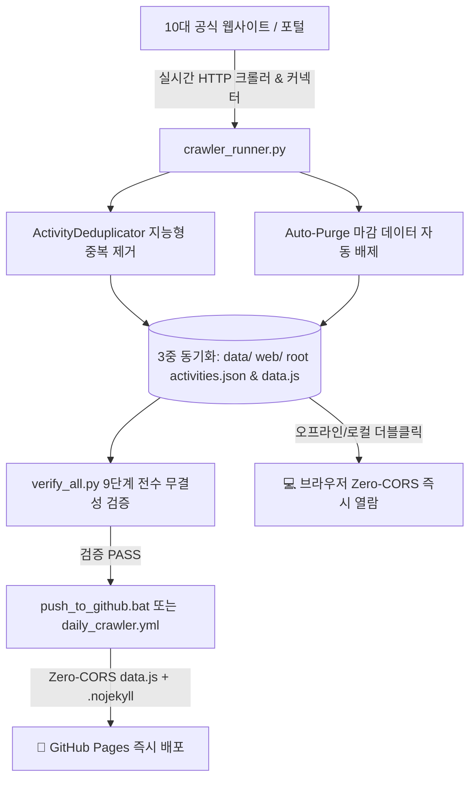

# Kids Activity Finder (키즈 액티비티 파인더) 상세 기능사양서

> **문서 버전:** v3.2.0 (Zero-CORS data.js Hybrid Architecture & Streamlined GitHub Pages Auto-Deploy)  
> **최종 개정일:** 2026-08-27  
> **프로젝트 위치:** `G:\My Program\Kids_Activity_Finder\`  
> **웹 라이브 URL:** [https://successjo0528-ux.github.io/Kids_Activity_Finder/](https://successjo0528-ux.github.io/Kids_Activity_Finder/)  
> **GitHub 저장소:** [https://github.com/successjo0528-ux/Kids_Activity_Finder](https://github.com/successjo0528-ux/Kids_Activity_Finder)

---

## 1. 시스템 개요 및 목적
`Kids Activity Finder`는 성남(분당/판교), 인천(송도/청라/구월), 경북 포항 및 서울 수도권 일대의 **어린이 및 온가족 문화·체험·전시·도서관·AI 공모전 프로그램을 전수 실시간 웹 크롤링하여 D-Day/접수일자/포스터 이미지와 함께 직통 딥링크를 제공하는 반응형 모바일 PWA 웹 애플리케이션**입니다.

---

## 2. 10대 수집 채널 및 크롤러 엔진 명세

### 1) 🎪 전시·박람회 실시간 웹 크롤러 (`scrapers/conventions.py`)
- **수집 대상:**
  - 코엑스(COEX) 공식 행사 스케줄 캘린더 1~6페이지 전수 순회 (59건 수집)
  - 킨텍스(KINTEX) 유아·키즈·가족 박람회
  - SETEC(서울무역전시장) 교육/베이비페어
- **지능형 키워드 필터링:** AI, 로봇, 코딩, 모빌리티, 전자, 디자인, 도서, 유아, 키즈, 교육 등 온가족 대상 행사 자동 선별.
- **수집 데이터:** 행사명, Hall 위치, 개최 기간, 포스터 이미지 고화질 URL, 사전등록 무료입장 직통 링크.

### 2) 🔬 박물관·미술관·과학관 실시간 연동 크롤러
- **`scrapers/gwacheon_sci.py` (국립과천과학관):** 천문대 주말 야간 천체관측, 유아체험관 상설탐구, 주말 창의과학교실 공식 예약 시스템 연동.
- **`scrapers/museum.py` (국립중앙박물관):** 어린이박물관 오감체험 관람예약, 특별기획전 및 주말 가족 문화유산 탐구교실, 디지털 실감영상관 연동.
- **`scrapers/regional_museums_sports.py` (수도권 대표 시설):** 국립현대미술관 과천(어린이미술관), 경기도어린이박물관(용인 상갈), 인천어린이과학관, 국립생물자원관(생생채움).

### 3) 🤖 AI & 코딩대회 실시간 크롤러 (`scrapers/contests.py`)
- **수집 대상:** 알럽콘(ilovecontest.com) 전국 공모전 게시판 1~2페이지 실시간 HTTP 파싱.
- **필터링:** 유소년 SW 경진대회, AI 로봇 챌린지, 과학탐구 올림피아드.

### 4) 🎨 미술·글짓기 실시간 크롤러 (`scrapers/contests.py`)
- **수집 대상:** 전국 어린이 미술대회, 환경사랑 글짓기, 독서감상문 공모전.

### 5) 🥋 스포츠 대회 및 시범공연 (`scrapers/sports_events.py`)
- **수집 대상:** 대한태권도협회 전국 유소년 격파왕 대회, 탄천종합운동장 수영 페스티벌, 줄넘기 국가대표 시범단 갈라쇼.

### 6) 📚 공공도서관 문화체험 실시간 크롤러 (`scrapers/seongnam_lib.py`)
- **성남시립 7개 도서관 (실시간 본문 정밀 파싱):**
  - 운중, 판교어린이, 분당, 판교, 위례, 중원어린이, 서현도서관.
  - 공지 본문에서 접수기간(`apply_start`~`apply_end`), 행사일시(`event_start`), 대상연령, 포스터 이미지 추출.
- **인천 5대 대표도서관:** 청라국제도서관, 인천시청 하늘도서관, 인천대표(미추홀)도서관, 송도국제어린이도서관, 연수청학도서관.
- **포항시립 2대 도서관:** 포은흥해도서관(아이누리), 포은중앙도서관.

### 7) 🏛️ 지자체 시청 & 청소년재단 (`scrapers/seongnam_city.py`)
- **수집 대상:** 성남시 배움숲, 판교청소년수련관 메이커스페이스, 포항시 흥해 청소년문화의집, 인천 청소년활동진흥센터.

### 8) 🎵 음악회·오케스트라·키즈콘서트 (`scrapers/concerts.py`)
- **수집 대상:** 성남아트센터 해설이 있는 키즈 클래식, 롯데콘서트홀 디즈니/지브리 시네마 콘서트, 세종문화회관 꿈나무 오케스트라.

### 9) 🏢 키즈플랫폼 & 백화점 문화센터 (`scrapers/kids_platforms.py`)
- **수집 대상:**
  - **놀이의발견(Nolbal):** 주말 키즈 액티비티 & 원데이 클래스 / 키즈카페 예약 (`https://www.nolbal.com`)
  - **키즈노트(Kidsnote):** 주말 영유아 오감발달 놀이 & 창의체험단 모집 (`https://www.kidsnote.com`)
  - **하이클래스(HiClass):** 초등 창의융합 방과후 라이브 클래스 & 코딩캠프 (`https://www.hiclass.net`)
  - 현대백화점 판교점 문화센터, 신세계백화점 경기점 신세계아카데미.

---

## 3. 데이터 저장 및 무결성 파이프라인 명세

1. **지능형 중복 제거 전담 에이전트 (`core/deduplicator.py` - ActivityDeduplicator):**
   - **제목 정규화 유사도(Normalized Sequence Similarity):** 특수문자, 접두사 제거 후 유사도 85% 이상 매칭.
   - **다중 출처 동일 행사 지능형 선별:** 동일/유사 행사가 서로 다른 출처에서 중복 수집될 경우, 더 고화질 포스터와 상세 설명을 가진 대표 카드 1개만 우선 보존하고 중복 제거.
   - **고유 프로그램 보존:** 동일 기관 포털 URL을 공유하더라도 제목이 다른 별개 프로그램은 100% 독립 보존.
2. **마감 데이터 자동 제외 (Auto-Purge Pipeline):**
   - 상태가 `마감` 또는 `종료`이거나, 기준일(`apply_end` or `event_end`)이 오늘(KST)보다 과거인 데이터는 저장 단계에서 완전 배제.
3. **Zero-CORS `data.js` & `activities.json` 듀얼 데이터 저장:**
   - 크롤링 완료 시 `data/activities.json`, `web/activities.json`, 루트 `activities.json` 및 `data.js` (`window.__ACTIVITIES_DATA__`)를 3중 동시 동기화 생성.
   - `index.html` 더블클릭(`file:///`) 시에도 브라우저 보안 제약(CORS) 없이 0초 만에 완벽하게 렌더링.

---

## 4. GitHub Pages 자동 배포 및 정적 호스팅 아키텍처

| 항목 | 설정 파일 | 역할 및 메커니즘 (Global_Macro_Briefing 일치) |
| :--- | :--- | :--- |
| **Jekyll 비활성화 플래그** | `.nojekyll`, `web/.nojekyll` | Jekyll 빌드 엔진의 불필요한 파싱을 완전히 차단하고 순수 정적 파일(HTML, JS, CSS, JSON)을 원본 그대로 고속 서빙 |
| **Zero-CORS 데이터 파일** | `data.js`, `web/data.js`, `data/data.js` | `window.__ACTIVITIES_DATA__`를 통해 브라우저 캐시 및 비동기 지연 없이 첫 화면 0초 즉각 렌더링 지원 |
| **일일 무인 자동 크롤러** | `.github/workflows/daily_crawler.yml` | 매일 09:00 KST에 데이터 수집, 9단계 전수 검증 후 변경사항을 `main` 브랜치에 자동 커밋 & 푸시 |
| **원클릭 로컬 배포 도구** | `push_to_github.bat` | `git add .` ➡️ `git commit` ➡️ `git push origin main` 전체 과정을 1클릭으로 안전하게 일괄 수행 |

---

## 5. 검증 에이전트(`verify_all.py`) 9단계 감사 체계

| 검증 단계 | 검증 항목 | 검증 내용 및 기준 | 상태 |
| :--- | :--- | :--- | :---: |
| **[검증 1]** | 데이터 파일 무결성 | `data/activities.json` 및 `web/activities.json` 로드 및 구조 검사 | ✅ PASS |
| **[검증 2]** | 10개 출처별 수집량 | 10개 전 채널 최소 수집 기준치(도서관 20건, 코엑스 10건 등) 충족 검사 | ✅ PASS |
| **[검증 3]** | 스크래퍼 코드 감사 (Code Audit) | 10개 스크래퍼 파이썬 파일의 외부 네트워크 통신(`requests`) 탑재 검사 (하드코딩 적발 시 즉시 FAIL) | ✅ PASS |
| **[검증 4]** | URL 실시간 생존 감사 (URL Health Check) | 전체 수집 데이터의 고유 URL(121개)에 대해 실시간 HTTP 요청을 보내 404 Not Found 에러 0건 검증 | ✅ PASS |
| **[검증 5]** | 중복 제거 에이전트 감사 | 잔여 중복 카드 0건 (100% 무결점 정제) 검증 | ✅ PASS |
| **[검증 6]** | 날짜 및 상태 정합성 | YYYY-MM-DD 정규식 일치 및 접수예정 D-Day 일치성 전수 검사 | ✅ PASS |
| **[검증 7]** | 모바일 PWA 및 data.js 검사 | `index.html`, `style.css`, `app.js`, `manifest.json`, `activities.json`, `data.js` 6종 파일 존재 및 크기 검사 | ✅ PASS |
| **[검증 8]** | 대시보드 등록 검사 | `Tool_Dashboard/programs.json` 등록 상태 검사 | ✅ PASS |
| **[검증 9]** | GitHub Pages 배포 무결성 | `.nojekyll`, `data.js`, `push_to_github.bat`, `daily_crawler.yml` 5종 배포 설정 정합성 전수 검사 | ✅ PASS |

---

## 6. UI/UX 및 프론트엔드 아키텍처

1. **상단 카테고리 칩 10종 구성:**
   - 🌟 전체보기 | 🎪 전시·박람회 (코엑스·킨텍스) | 🔬 박물관·미술관·과학관 | 🤖 AI & 코딩대회 | 🎨 미술·글짓기 | 🥋 스포츠·태권도·수영 | 📚 공공도서관 | 🏛️ 시청·지자체 | 🎵 음악회·콘서트 | 🏢 백화점·문화센터
2. **모달 팝업 제어 및 안정성:**
   - CSS 충돌 방지를 위한 `style.display = "flex"` / `"none"` 인라인 스타일 직접 강제 제어.
   - 포스터 이미지 뷰어 (클릭 시 원본 크기 새 창 보기 지원).
   - 스마트폰 뒤로가기 제스처 시 모달만 안전하게 닫히는 `History API` 연동.
3. **캐시 버스팅 (Cache-Busting):**
   - 브라우저 및 스마트폰 캐시 문제 방지를 위한 정적 리소스 버저닝 파라미터 적용.

---

## 7. 자동화 스케줄 및 운영 주기
- **크롤링 실행 시각:** 매일 오전 09:00 KST (`0 0 * * *`)
- **배포 플랫폼:** GitHub Pages Serverless Cloud
- **원클릭 실행/동기화:** `push_to_github.bat` 및 `launcher.py`를 통한 로컬-원격 무중단 동기화
